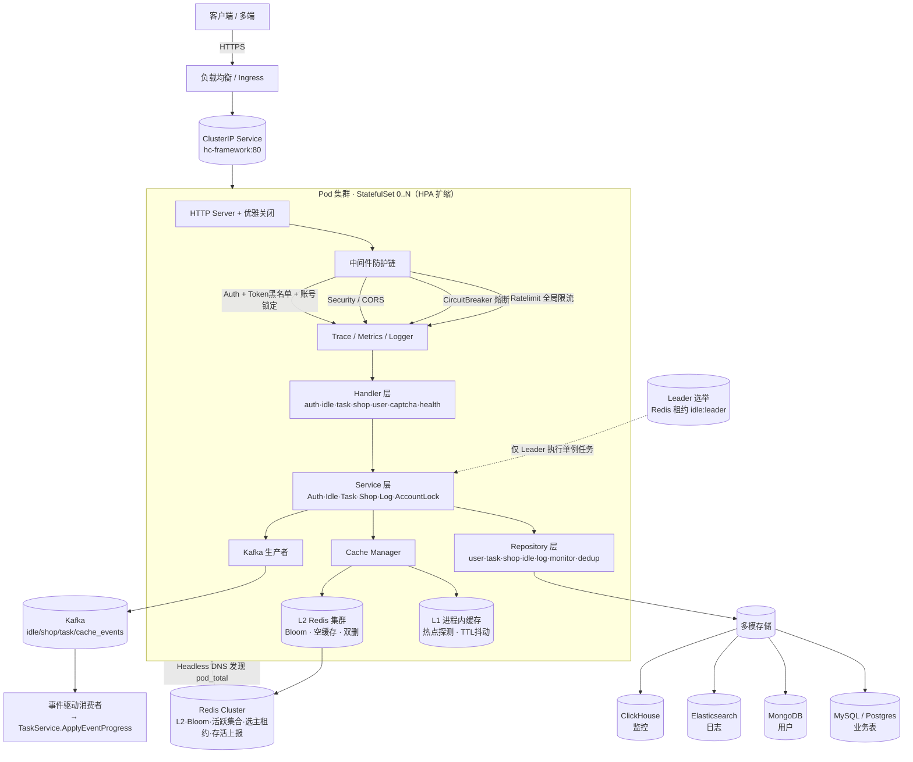
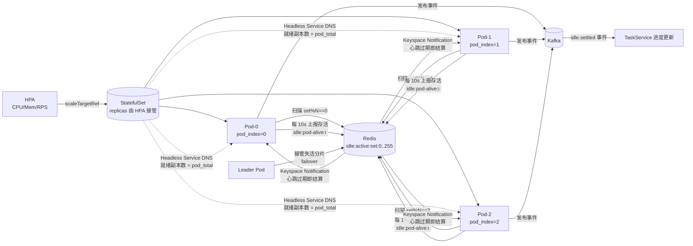
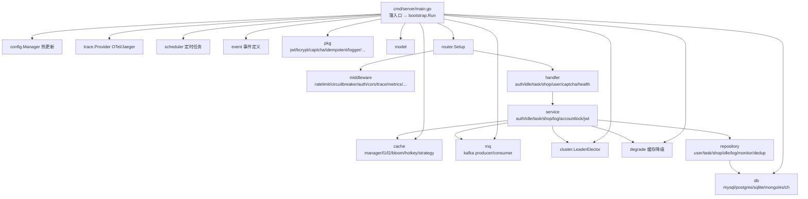
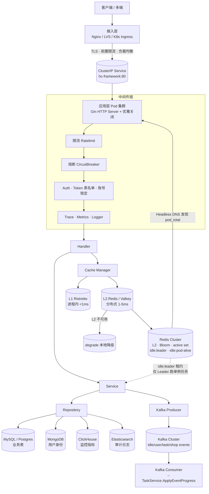
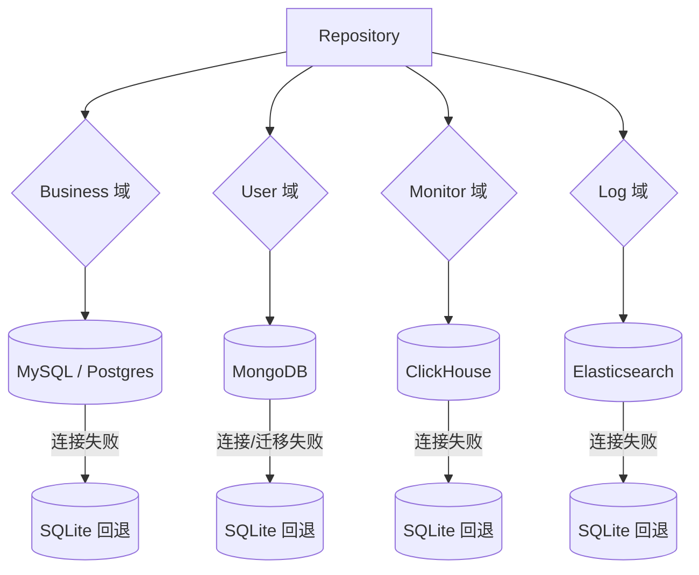
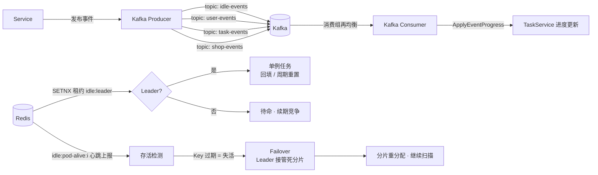

# 高并发架构与结构说明

> 本文基于 `internal/bootstrap`（`App.Run()` 组合根）的依赖装配流程与 `internal/`、`pkg/`、`deployments/` 的真实代码/清单整理，描述本框架的**系统架构**、**多副本部署协作拓扑**与**代码模块结构**，并提炼高并发核心机制。

## 一、高并发系统架构图



## 二、多副本部署与高并发协作拓扑



> 关键约束：HPA 的 `scaleTargetRef` 必须指向 **StatefulSet**（而非 `deployment.yaml` 的 Deployment）。`deployment.yaml` 未注入 `HC_POD_INDEX`、无稳定序号，无法分摊扫描分片；若 HPA 扩缩 Deployment，承载扫描分片的 StatefulSet 不变，扩缩失去意义。Headless Service 名为 `hc-framework-headless`（见 `deployments/statefulset.yaml` 末尾），与普通 ClusterIP Service（`hc-framework`）不同名，两者 selector 一致、互不冲突。

## 三、代码模块结构图



## 四、高并发核心机制小结

- **接入/防护链**：Ratelimit（全局令牌桶，429）→ ConcurrencyLimit（应用层有界并发/负载卸载，503）→ CircuitBreaker（熔断）→ Security/CORS → Auth（JWT + Token 黑名单 + 账号锁定 Redis 共享）。参数经 `config.Manager` 支持热更新（SIGHUP / `/debug/reload`）。负载卸载与限流/熔断维度互补，覆盖「速率 / 在途量 / 下游健康度」三层过载保护（[20_高并发架构设计实践.md](./20_高并发架构设计实践.md)）。
> 上述接入/防护链中限流、熔断、认证、账号锁定的机制与参数，以 [11_安全与防护.md](./11_安全与防护.md)（安全专题单一来源）为准。
- **多级缓存**：L1 进程内（热点 key 探测 + TTL 抖动抗穿透/雪崩）+ L2 Redis 集群（Bloom 防穿透、空缓存、双删）+ L2 不可用时自动降级（`degrade`）。
- **幂等与乐观锁**：`pkg/idempotent` + `event_dedup` 表去重；结算/周期重置用乐观锁，多副本重复执行安全。
- **挂机检测三高并发设计**：分片扫描（Pod Sharding，O(N) 线性分摊）→ 事件驱动（Keyspace Notification 零轮询）→ 心跳批量落库（本地聚合）→ 死分片接管（failover）→ 选主（Leader 单例任务）→ Headless 动态发现（HPA 扩缩）。
- **异步解耦**：Kafka 事件流（idle/shop/task/cache_events）实现事件驱动进度更新与写降级异步刷新。
- **可观测**：OTel 链路追踪（W3C traceparent）+ Metrics + 结构化日志。
- **多存储**：MySQL/Postgres（业务）、MongoDB（用户）、Elasticsearch（日志）、ClickHouse（监控），按访问特征分层。

## 四·续、本轮高并发 / 高可用 / 易扩展加固（需求 §6 落地）

在既有分层架构之上，本轮对「连接防护 / 连接池 / 上下文生命周期 / 熔断面 / 读写分离探活」五处短板做了工程化加固，全部向后兼容、不破坏既有测试。

### A. HTTP Server 连接级加固（可用性 · `internal/bootstrap/connlimit.go` + `app.go`）

- **请求头上限** `server.max_header_bytes`：限制单请求头字节数（默认 1MB），防御超大/畸形请求头占用内存与慢头攻击。
- **连接数上限**：Go 标准库 `http.Server` **无** `MaxConns`/`MaxConnsPerIP` 字段，故在 `net.Listener` 的 `Accept` 阶段用 `connLimitListener` 拦截（见 `internal/bootstrap/connlimit.go`）：
  - `server.max_conns`：全局并发连接数上限，超限新连接被**立即关闭（连接级快速失败）**，保护后端资源不被连接风暴打垮；
  - `server.max_conns_per_ip`：单 IP 并发连接数上限，基础连接级限流，防止单一客户端耗尽连接。
- 超限即丢（非阻塞等待），避免 SYN 队列被慢连接占满；K8s 下仍依赖 readiness/HPA 做进程级容量兜底。
- 改用 `net.Listen` + `srv.Serve(ln)` 取代 `srv.ListenAndServe()`，以便注入自定义 Listener，且不影响 `srv.Shutdown` 优雅关闭语义。

### B. 数据库连接池配置化（并发 / 易扩展 · `internal/config/config.go` + `internal/db/mysql.go` + `internal/bootstrap/bootstrap.go`）

- 此前 `user` / `monitor` / `log` 三类库的连接池写死在适配器默认值（`max_open=100`），高并发下成为隐性瓶颈且不可调。
- 新增统一的 `db.PoolConfig`（以及配置层 `DriverConfig.Pool` / `DBPoolConfig`），使 `user` / `monitor` / `log`（driver 为 mysql/postgres 时）与 `business` 一样可由运维按容量调整 `max_idle_conns` / `max_open_conns` / `conn_max_lifetime`。
- `bootstrap` 以「值」形式（`db.PoolConfig`）透传池参数，规避 mysql/postgres 两种不同选项类型在同一变参签名里冲突；仅当显式配置了 `max_open/max_idle > 0` 时才覆盖适配器默认，避免「0 值」误当「无限制」。sqlite / mongo / es / ch 路径忽略该配置。
- Postgres 读写分离路径（`CreateRWDBFromPostgresConfig`）补充可变形参以接入业务库连接池，与 MySQL 变体保持一致。

### C. 统一 Context 树（优雅关闭正确性 · `internal/bootstrap/app.go`）

- `bgCtx`（`context.WithCancel`）统一取消所有「监听 / 轮询 / 补偿」类后台协程，使优雅关闭（`SIGINT`/`SIGTERM`）时它们随 `bgCancel` 退出，而非依赖 `context.Background()` 永不取消导致被硬杀或 goroutine 泄漏。
- 本轮将此前误用 `context.Background()` 的常驻协程全部挂到 `bgCtx`：**Leader 选举循环**（`leader.Start(bgCtx)`）、**事件驱动结算订阅**（`StartEventDriven(bgCtx)`）、**心跳批量落库定时器**（`StartHeartbeatFlush(bgCtx)`）。事件消费者订阅与探活后台协程此前已正确绑定。

### D. 公开认证路由熔断（可用性 · `internal/router/router.go`）

- 原熔断中间件仅挂在鉴权后的 `authorized` 组；公开认证路由（register / login）直接写库，下游 DB / 缓存抖动时请求会在认证入口堆积、耗尽连接。
- 本轮在 `/auth` 组挂 `middleware.CircuitBreaker`：熔断按路由（`c.FullPath()`）独立、仅响应 ≥500 计入失败（4xx 不误触发），下游抖动时快速失败并触发全局降级；与 `authorized` 组共用配置化熔断管理器，支持 `/debug/reload` 热更新阈值。

### E. 读写分离探活锁竞争优化（并发 · `internal/db/rw_db.go`）

- `pingAndUpdateSlaves` 旧实现：在阻塞式 `ping`（每个从库最长 2s）期间**长期持有写锁**，期间 `pickSlave` / `Ping` 的读锁被串行阻塞，从库越多读路径延迟越高。
- 新实现：仅在读锁下快照从库列表 → **锁外执行阻塞 ping** → 短暂写锁原子替换健康集合（`unhealthySet`）。读路径（从库轮询）几乎不再被探活阻塞，显著降低锁竞争、提升高并发下读吞吐。

### F. 缓存异步写 goroutine 上下文收敛（优雅关闭 / 资源泄漏 · `internal/cache/strategy.go`）

- 三级缓存的「尽力而为」异步写原先用 `context.Background()` 且无超时：布隆过滤器写入（`Bloom.Add`）、L2 广播失效（`L2.Publish`）、写降级本地回填（`L2.Set`）、空值标记（`L2.SetNull`）各起 goroutine 后脱离进程生命周期管理。Redis 抖动 / 进程关闭期这些 goroutine 会**永久阻塞泄漏**（无 deadline、无 cancel）。
- 新增 `asyncWriteTimeout = 3s` 与辅助方法 `bgAsyncCtx()`，4 处异步写统一改用「带固定短超时的 context」：即便下游卡住也会在 3s 内自行退出，避免优雅关闭期或 Redis 不可用时的 goroutine 资源泄漏（需求 §6 优雅关闭正确性）。
- 顺带修正广播失效监听的 per-message 处理：原 `Invalidate(context.Background(), key)` 改为复用外层订阅 ctx（由 `cache.Manager` 的可取消 `invalCtx` 派生），随订阅退出而取消，不再用永不取消的 `Background`。

### G. 应用层有界并发 / 负载卸载（高并发可用性 · `internal/middleware/concurrency.go` + `internal/router/router.go`）

- 防护分层的定位：在「连接级上限（`MaxConns`）」与「令牌桶限流（`Ratelimit`）」**之后、业务处理器之前**，对同时在途的请求数再设一道进程级硬上限（`server.concurrency_limit`）。达到上限即**非阻塞快速失败返回 503**（load shedding），而不是让请求在应用层无限堆积、逐渐拖垮 DB 连接池与下游服务。
- 与限流 / 熔断的维度差异（三者互补，不可互相替代）：
  - **限流（Ratelimit）** 按「速率」：`rate` 个请求/秒，超速率返回 429；
  - **并发限流（本机制）** 按「同时进行的量」：同一时刻最多 `concurrency_limit` 个请求在被处理，超出返回 503；
  - **熔断（CircuitBreaker）** 按「下游健康度」：下游错误率超阈即拒绝并降级。
  - 组合使用可同时约束「速率」与「在途量」——短时突发（速率未超、但瞬时并发极高）正是把 DB 连接池打满的典型场景，仅靠限流无法拦截。
- 实现要点：`golang.org/x/sync/semaphore.Weighted` 做有界信号量，`TryAcquire` **非阻塞**（拿不到立即 503，不引入排队等待，避免放大尾延迟、与 `RequestTimeout` 抢资源）；系统/运维端点（`/health`、`/ready`、`/metrics`、`/debug/*`、`/swagger`）**豁免**，保证 K8s 探针与指标抓取、运维 API 在过载时仍可用（否则就绪探针 503 会触发 K8s 误杀正在排空的 Pod）。信号量容量启动期固定、不可动态伸缩，故与 `MaxConns` 一致为「重启生效」，不受热更新影响。
- in-flight 并发水位经 `http_concurrency_in_flight`（Gauge）暴露，被拒绝数经 `http_concurrency_rejected_total`（Counter）暴露，便于观测并发水位与容量合理性（见 [09_可观测性与告警.md §2.1](./09_可观测性与告警.md)）。

### H. 优雅下线排水（高可用 · `internal/handler/health_handler.go` + `internal/bootstrap/app.go`）

- 就绪探针 `/ready` reflect 进程级 `serving` 标志：启动完成（HTTP 开始监听）后由 bootstrap 置 `true`；**优雅关闭一开始即置 `false`**（`shutdown` 首步，早于 `srv.Shutdown`）。
- `serving=false` → `/ready` 立即返回 503 → K8s 就绪探针失败 → 本 Pod 从 Service 端点摘除、负载均衡停止转发新流量；随后 `srv.Shutdown` 仅排空已建立的在途请求（drain）。即「**先摘流量、再排空中途请求**」，避免关闭瞬间仍进新流量导致 5xx。
- 与 §四·续 A 的连接级快速失败、`app.go` 的 10 步有序关闭共同构成完整的「过载保护 + 优雅退出」能力。

> 以上 G/H 两项与既有分层防护链、读写分离、选主/分片/降级共同构成高并发高可用架构，系统设计与落地细节见 [20_高并发架构设计实践.md](./20_高并发架构设计实践.md)。

## 五、扫描分片：Pod Sharding 优先级

`internal/service/idle/scan_sharding.go` 中 `resolvePodTotal` 的优先级（headless 模式必须优先于静态注入，否则 HPA 扩缩被 `HC_POD_TOTAL` 覆盖而失效）：

```
配置值 PodTotal > Headless DNS 发现（pod_discovery=headless） > HC_POD_TOTAL 环境变量 > 1
```

`configmap.yaml` 默认开启 `pod_discovery=headless` + `headless_service=hc-framework-headless`，副本数由进程经 DNS 自动感知，运行期 `statefulset.yaml` 的 `replicas` 由 HPA 接管（仅作初始值）。

## 六、组件级联关系图（Nginx / MySQL / Mongo / Redis / Kafka / ES / CH）

> 本节刻画**各程序/中间件之间的级联（调用链 + 数据 / 故障传播）关系**。实线为请求/数据流，虚线为协调/发现流。

### 6.1 整体级联拓扑（接入 → 应用 → 缓存 → 数据 → 异步）



**级联要点**
- 接入层 Nginx 仅做 TLS 卸载、前置限流与负载均衡，将流量交 ClusterIP Service 分发到 Pod 集群；应用层与数据层解耦，任一 Pod 宕机由 Service/Headless DNS 自动摘除。
- `Cache Manager` 串接 L1→L2；L2 不可用时经 `degrade` 跳过 Redis 直读 DB，**不级联失败到整体不可用**。
- `Repository` 按域写不同存储；Redis 既作 L2 缓存，又承载挂机检测的状态（活跃集合、选主、存活），属"共享协调平面"。

### 6.2 三级缓存读写级联（L1 → L2 → L3）

```mermaid
flowchart TB
    REQ([读请求 key]) --> C1{L1 命中?}
    C1 -->|是| HIT1([返回 <1ms])
    C1 -->|否| C2{L2 命中?}
    C2 -->|是| HIT2([返回 1-5ms · 回填 L1])
    C2 -->|否| BLOOM{Bloom 可能存在?}
    BLOOM -->|否(确定不存在)| MISS([返回空 · 不查 DB<br/>防穿透])
    BLOOM -->|是(可能)| DBQ[(查 L3 存储<br/>MySQL/Mongo/...)]
    DBQ -->|命中| WB[写回 L2 · 写回 L1 · 返回]
    DBQ -->|空| WB2[写空缓存(短TTL) · 加 Bloom · 返回]

    W([写请求]) --> DEL[L2 双删 + 失效 L1]
    DEL --> WDB[(写 L3 存储)]
```

**级联要点**
- 读路径级联：L1 → L2(Bloom 防穿透) → L3；命中即短路返回，越往下延迟越高。
- 写路径级联：先失效/双删 L2 + L1，再落 L3，保证缓存与 DB 最终一致。
- 缓存击穿/雪崩防护：热点 key 探测（HotKey）+ TTL 抖动（随机偏移），避免同一时刻集中失效。

**⚠️ 读取还原约定（必读，防命中即 panic）**

L1(Ristretto) 与 L2(Redis) **均以 JSON 字节存储值**（见 `internal/cache/l1.go`、`l2.go`）。因此 `cacheMgr.Get` 的返回值 `interface{}` 在不同路径下类型不同：

| 路径 | 返回的动态类型 |
|------|----------------|
| 缓存未命中、回源函数直返 | 原始 Go 类型（如 `*model.Task`、`[]model.Task`） |
| L1 / L2 命中，JSON 对象反序列化 | `map[string]interface{}` |
| L1 / L2 命中，JSON 数组反序列化 | `[]interface{}` |

**Repository 读缓存后禁止直接做类型断言**（如 `val.(*model.X)` / `val.([]model.X)`）——命中缓存时断言失败会 panic，被熔断器 recover 后表现为 `10003 internal server error`（曾导致压测大面积失败）。必须统一经泛型助手还原：

```go
val, err := r.cacheMgr.Get(ctx, key, ttl, loader)
if err != nil { return nil, err }
return cache.DecodeCached[*model.Task](val)   // 单对象
// 或
return cache.DecodeCached[[]model.Task](val)  // 切片
```

`DecodeCached[T]`（`internal/cache/manager.go`）兼容三种情形：`nil` → 零值；已是 `T` → 零拷贝直返；其他中间类型（map / 切片）→ 经 JSON 中转还原为 `T`。新增走缓存的读方法时务必沿用此约定。

### 6.3 存储域级联与故障回退（主存储 → SQLite 回退）

每个数据域在**主存储连接/迁移失败**时级联回退到本地 SQLite，保证进程不整体崩溃；回退链路如下：



**级联要点**
- Business：`MySQL/Postgres`（读写分离可选，走 `RWDB`）→ 失败回退 `SQLite`。
- User：`MongoDB`（文档型用户身份）→ 失败回退 `SQLite`。
- Monitor：`ClickHouse`（列式监控指标）→ 失败回退 `SQLite`。
- Log：`Elasticsearch`（审计日志检索）→ 失败回退 `SQLite`。
- 回退为**单节点本地存储**，仅保障可用性兜底；生产应恢复主存储以获得水平扩展与高可用。

### 6.4 异步事件与协调级联（Kafka + Redis 选主 / 死分片接管）



**级联要点**
- 事件流级联：Service 发布 → Kafka（4 主题）→ 消费组再均衡分发 → `TaskService.ApplyEventProgress`，实现写路径异步解耦。
- 协调级联：Redis `idle:leader` 租约决定单例任务归属；`idle:pod-alive:{i}` 心跳过期触发 Failover，由 Leader 接管该 Pod 分片，消除"Pod 宕机 → 分片永不被扫描"的级联缺口。
- 二者叠加 Headless DNS 动态发现，使副本数变化（HPA）在**不修改任何静态配置**的情况下被自动感知与重平衡。

## 七、部署清单一览（deployments/）

`deployments/` 共 17 个清单：`service` / `statefulset` / `hpa` / `configmap` / `deployment` / `pdb` / `secret` / `ingress` / `nginx.conf` / `networkpolicy` / `redis-cluster` / `mysql-mgr` / `kafka` / `mongodb-rs` / `elasticsearch` / `clickhouse` / `grafana`。

> 完整文件用途、关键规则与**推荐 `kubectl apply` 顺序**见 [07_集群设备部署手册.md](./07_集群设备部署手册.md) 的「部署速查」一节（权威来源，可独立分发）。本节约作索引，避免重复维护。

> 推荐 apply 顺序（整目录 apply 由 kubectl 依赖排序保障）：先 NetworkPolicy/接入（二选一）→ 中间件（StorageClass 需提前存在）→ 应用与弹性（StatefulSet 就绪后再挂 HPA）。
> 完整文件用途、关键规则与**推荐 `kubectl apply` 顺序**已整理为可单独分发的部署手册：[07_集群设备部署手册.md](./07_集群设备部署手册.md) 的「部署速查」一节（§11.2 容量呼应、§12.3 文件总览）。

---

## 八、百万设备在线 · 部署级联与硬件规划

> 本章（容量基线、服务器/容器总览、各集群拓扑、逻辑/物理级联图、网络与网络安全规则、中间件与剩余集群部署清单、压测验证）已整理为**可单独分发的独立部署手册**：[07_集群设备部署手册.md](./07_集群设备部署手册.md)。
> 该手册内置「部署速查」：`deployments/` 各文件用途与推荐 `kubectl apply` 顺序单列，便于运维 / SRE 团队直接取用，无需携带整份架构文档。
> 系统架构与组件级联背景见第六章。

