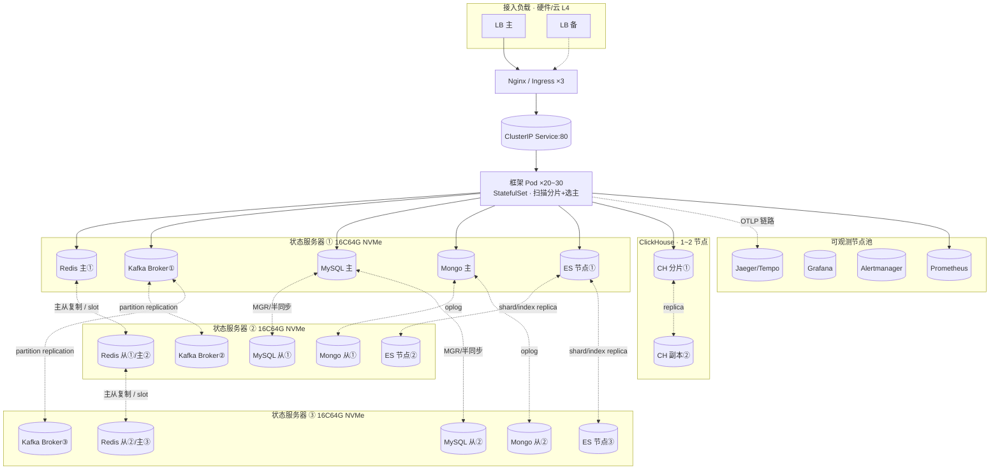
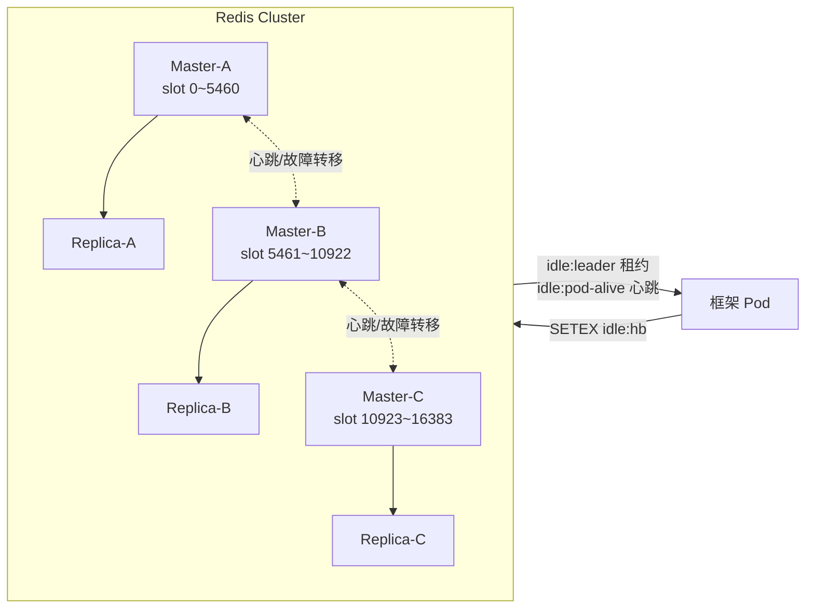
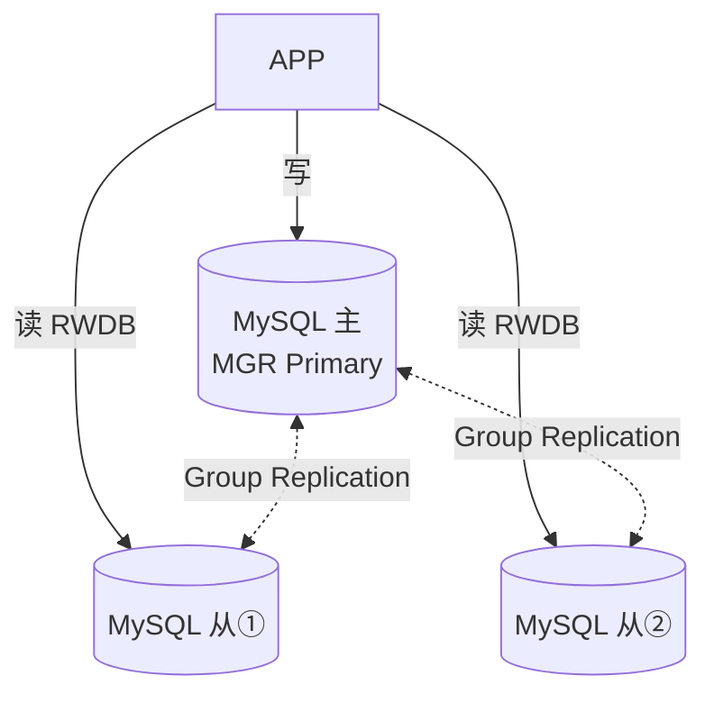
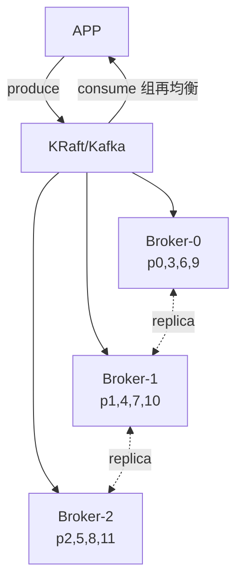
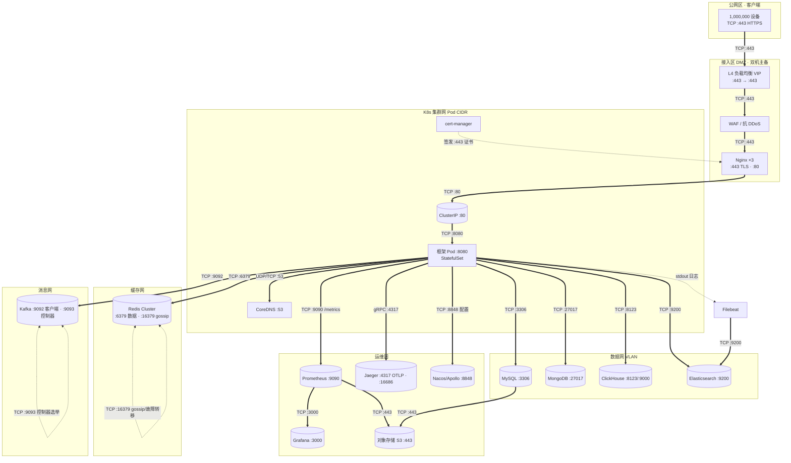

# 百万设备在线 · 部署级联与硬件规划（独立部署手册）

> 本手册从 [101_架构说明.md](./101_架构说明.md) 第八章整理抽取，作为可单独分发的「集群设备部署手册」，供运维 / SRE 团队直接取用，无需携带整份架构文档。
> 系统架构与组件级联背景见 [101_架构说明.md](./101_架构说明.md) 第六、七章。
> 基线假设：`heartbeat_interval=30s`、`timeout_threshold=90s`、1,000,000 设备常驻在线。

## 本文结构（章节索引）

- [部署速查](#部署速查deployments-各文件用途与-apply-顺序) — `deployments/` 文件用途与 apply 顺序
- [一、容量基线（回顾）](#一容量基线回顾)
- [二、服务器与容器总览](#二服务器与容器总览)
- [三、物理服务器 → 容器归属图](#三物理服务器--容器归属图)
- [四、各集群内部拓扑](#四各集群内部拓扑)
- [五、还需要什么设备 / 组件](#五还需要什么设备--组件)
- [六、容灾与反亲和原则](#六容灾与反亲和原则)
- [七、配置 / 清单落地清单](#七配置--清单落地清单)
- [八、总级联结构图](#八总级联结构图所有程序--集群)
- [九、各程序物理连接图](#九各程序物理连接图网络分区--端口--协议)
- [十、网络 / 安全组（NetworkPolicy）](#十网络--安全组networkpolicy规则清单)
- [十一、中间件部署清单](#十一中间件部署清单redis--kafka--mysql)
- [十二、剩余集群清单 + 容量压测验证](#十二剩余集群清单--容量压测验证)

> 本手册为**独立分发**设计，刻意保持单文件形态；如需按主题物理拆分，可基于上述章节索引切分为「部署速查 / 容量与硬件 / 网络与安全组 / 压测验证」四份，但会失去单文件可分发的便利性（拆分后相关交叉引用需同步更新）。

## 部署速查（deployments/ 各文件用途与 apply 顺序）

### deployments/ 文件用途

| 类别 | 文件 | 用途 | 关键说明 |
|------|------|------|----------|
| 接入 | `nginx.conf` | 独立 Nginx 接入（LVS / 边缘节点前） | `upstream → hc-framework:80`；心跳 `location = /api/v1/idle/heartbeat` **豁免限流**；其它走 `limit_req`；TLS 卸载；`keepalive 256` |
| 接入 | `ingress.yaml` | K8s Ingress（ingress-nginx） | `limit-rps:5000` 外层闸门；cert-manager `hc-tls-secret`；心跳路径豁免；指向 `hc-framework:80` |
| 网络安全 | `networkpolicy.yaml` | NetworkPolicy 安全组 | 默认拒绝 → 放行 DNS、Ingress→App:8080、App→Redis/MySQL/Mongo/CH/ES/Kafka、App→Prometheus/Jaeger/Nacos、App→对象存储/外部 :443 |
| 缓存 | `redis-cluster.yaml` | Redis Cluster 3 主 3 从 | `--cluster-enabled yes`；Headless `redis-cluster`；bootstrap Job 一次性建集群；`maxmemory 2gb`/`allkeys-lru` |
| 消息 | `kafka.yaml` | Kafka KRaft 3 Broker | 无 ZooKeeper；`replication.factor=3`、`min.insync.replicas=2`、`partitions=12` |
| 业务库 | `mysql-mgr.yaml` | MySQL Group Replication 单主 | 仅 `mysql-0` bootstrap_group；读写分离由应用完成 |
| 用户库 | `mongodb-rs.yaml` | MongoDB 副本集 3 | `--replSet rs0`；init Job `rs.initiate` |
| 日志 | `elasticsearch.yaml` | Elasticsearch 3 | `max_map_count=262144`；`XPACK_SECURITY_ENABLED=false`；`discovery.seed_hosts` 三节点 |
| 监控 | `clickhouse.yaml` | ClickHouse 1 分片 2 副本 | 每 Pod 内嵌 Keeper；`CLICKHOUSE_KEEPER_ID` 由 ordinal 推导 |
| 可观测 | `grafana/hc-framework-dashboard.json` | Grafana 面板 | 12 面板：QPS 按路由、错误率、延迟 p95/p99、限流拒绝、熔断状态、L1 缓存命中率等 |
| 应用配置 | `configmap.yaml` | 应用 ConfigMap | 开启分片 / 选主 / 读写分离 / `MQ=kafka` / Redis 集群地址 |
| 应用密钥 | `secret.yaml` | 密钥 | JWT 签名密钥等 |
| 应用服务 | `service.yaml` | ClusterIP Service | `:80` |
| 应用工作负载 | `statefulset.yaml` | StatefulSet | 扫描分片 + 选主；`HC_POD_INDEX`/`HC_POD_TOTAL`；`podAntiAffinity`；含 Headless Service `hc-framework-headless` |
| 应用弹性 | `hpa.yaml` | HPA | `scaleTargetRef.kind=StatefulSet`；`min=3/max=30` |
| 应用补充 | `deployment.yaml` | Deployment（单 / 双实例） | 未注入 `HC_POD_INDEX`，不承载扫描分片 |
| 应用保护 | `pdb.yaml` | PodDisruptionBudget | 滚动更新 / 节点驱逐时保最少可用 |
| 压测 | `scripts/loadtest-heartbeat` | 心跳压测脚本 | 本地 HS256 签 JWT，模拟 N 设备周期心跳，统计 RPS / P50·P95·P99 |

> 接入方式二选一：**已有独立 Nginx / 硬件 L4** → 用 `nginx.conf`；**纯 K8s 环境** → 用 `ingress.yaml`（二者不要同时承载同一入口）。

### 推荐 apply 顺序

```bash
# 0) 前置：StorageClass 需提前存在（清单默认 nvme-sc）；命名空间按需创建
# 1) 基础设施先于应用：网络策略、接入（二选一）
kubectl apply -f deployments/networkpolicy.yaml
kubectl apply -f deployments/nginx.conf        # 或 deployments/ingress.yaml

# 2) 中间件（StorageClass 需提前存在）
kubectl apply -f deployments/redis-cluster.yaml
kubectl apply -f deployments/kafka.yaml
kubectl apply -f deployments/mysql-mgr.yaml
kubectl apply -f deployments/mongodb-rs.yaml
kubectl apply -f deployments/elasticsearch.yaml
kubectl apply -f deployments/clickhouse.yaml
#    Redis 集群需 bootstrap Job（文件内已含，apply 后即执行）：
#    kubectl wait --for=condition=Ready pod/redis-cluster-5 --timeout=120s

# 3) 应用与弹性
kubectl apply -f deployments/configmap.yaml
kubectl apply -f deployments/secret.yaml
kubectl apply -f deployments/service.yaml
kubectl apply -f deployments/statefulset.yaml
kubectl apply -f deployments/hpa.yaml
#    deployment.yaml / pdb.yaml 为补充清单，按需 apply
```

> 推荐整目录 apply 也可：`kubectl apply -f deployments/`（kubectl 会按依赖排序：先 Service/ConfigMap/Secret，再 StatefulSet，最后 HPA）。

---

> 本手册承接 [101_架构说明.md](./101_架构说明.md) 第六、七章的级联关系，落到**具体硬件**：需要多少台服务器、跑多少个容器、各存储 / 中间件集群长什么样、还缺哪些设备。
> 基线假设：`heartbeat_interval=30s`、`timeout_threshold=90s`、1,000,000 设备常驻在线。

## 一、容量基线（回顾）

| 指标 | 测算 | 结论 |
|------|------|------|
| 心跳写速率 | 1M / 30s ≈ **3.3 万 SETEX/s**；设备时钟抖动峰值 ×3 → **~10 万/s** | 心跳已"去 DB 化"，**仅 1 次 Redis 写，零 DB 写** |
| Redis 内存占用 | `idle:hb` ~130B×1M=130MB + 活跃集合 256 分片 ~30MB + Bloom(1 亿) ~140MB + 积分计数 ~40MB | 总计 **< 1GB** |
| 业务库写压力 | 仅 start/stop/settle 生命周期写，稳态离线率极低 | 业务库**几乎无压力** |
| 离线检测 | Pipeline 批量 `EXISTS`（每批 100），按 Pod 分片（256 分片散到各 Pod） | 非瓶颈 |
| **真正瓶颈** | **Redis 的 SETEX 吞吐 + 连接数**，不在 DB、不在扫描 | 必须 **Redis 集群化 + 心跳纯 Redis 化 + Pod 分片扫描**（代码已具备） |

## 二、服务器与容器总览

> 设计目标：**任意单台服务器宕机，集群不丢数据、不中断在线判活**（跨机反亲和）。
> 容器数取"稳态 20 Pod"；HPA 峰值时应用层最多扩到 30 Pod（见 8.7），容器总数随之 +10。

### 2.1 推荐最小 HA 拓扑（约 13 台服务器 + 1 对硬件 LB）

| 层 | 角色 | Docker 容器数 | 建议服务器数 | 每台规格 | 说明 |
|----|------|--------------:|-------------:|----------|------|
| **接入** | L4 负载均衡（F5 / 云 SLB / LVS+Keepalived） | 0（硬件/云） | **2**（主备） | 2×10GbE | 非容器，硬件或云产品 |
| **接入** | Nginx / Ingress Controller | 3 | 随应用节点池 | — | TLS 卸载、前置限流、连接打散 |
| **应用** | 框架 Pod（StatefulSet，扫描分片 + 选主） | **20（峰 30）** | 8~10（节点池） | 16 vCPU / 64GB | HPA `min=3 max=30`，CPU70%/内存80%/RPS2000 触发 |
| **缓存** | Redis Cluster（3 分片 × 主从） | **6** | 3（每机 2） | 16 vCPU / 64GB / NVMe | 每主 ~3.3 万 ops/s，内存 <1GB |
| **业务库** | MySQL InnoDB Cluster / MGR（1 主 2 从） | **3** | 3（每机 1） | 16 vCPU / 64GB / NVMe | `read_write_split` 已开 |
| **消息** | Kafka（3 Broker，分区 12 × 副本 3） | **3** | 3（每机 1） | 8 vCPU / 32GB / NVMe | 4 主题 idle/user/task/shop |
| **用户库** | MongoDB 副本集（1 主 2 从） | **3** | 3（每机 1） | 8 vCPU / 32GB / NVMe | 文档型用户身份 |
| **日志** | Elasticsearch（3 节点） | **3** | 3（每机 1） | 8 vCPU / 32GB / NVMe | 审计日志检索 |
| **监控** | ClickHouse（1 分片 2 副本 / 或单节点） | **2** | 1~2 | 8 vCPU / 32GB | 列式监控指标 |
| **可观测** | Prometheus + Grafana + Alertmanager + Jaeger/Tempo | **4** | 2（节点池） | 8 vCPU / 32GB | OTLP 已配 `jaeger-collector:4317` |
| **合计** | | **≈ 47（峰 57）** | **≈ 13 + 2 LB**（+3 控制面*） | | *若自管 K8s 需另加 3 台 master（轻量 4 vCPU/8GB）|

### 2.2 更稳的拆分（若 IOPS/隔离要求高）

把状态存储层从"3 台统统塞"改为**每类集群独占 3 台**（共 9 台状态服务器 + 8~10 应用节点），可彻底避免 NVMe IOPS 争抢；代价是服务器数升到 ~21 台。容量与容器数不变，仅分布更稀疏。

## 三、物理服务器 → 容器归属图

> 下图左侧 3 台为**状态存储服务器**（每类集群的 3 实例错开分布，主从不共线）；右侧为**应用/接入/可观测节点池**（K8s 调度，含 HPA 弹性 Pod）。



**关键约束**：每个集群的"主"与它的"副本"必须落在**不同服务器**（上图已错开），否则单台宕机即丢集群可用性；K8s 下用 `podAntiAffinity`（`statefulset.yaml` 已配 `topologyKey: kubernetes.io/hostname`）强制。

## 四、各集群内部拓扑

### 4.1 Redis Cluster（3 主 × 3 从，16384 slot 哈希分片）

- 心跳 key `idle:hb:{user}:{device}` 按 `{user}` hash-tag 落到固定 slot，单用户多设备同分片，便于批量判活。
- `event_driven_settle` 在集群模式下**自动禁用**，离线检测回退为 Pod 分片轮询（设计如此，勿误配）。

### 4.2 MySQL InnoDB Cluster / MGR（单主，读写分离）

- `read_write_split.enabled=true`（configmap 已开）；`20260708_initial_schema` 迁移保障 1M settle 扫描命中索引。

### 4.3 Kafka（3 Broker，4 主题各 12 分区 × 副本 3）

- Broker 地址已写死 `kafka-broker-0/1/2:9092`（configmap）；副本因子 3 容忍单 Broker 宕机。

### 4.4 MongoDB 副本集 & 8.4.5 Elasticsearch
- **MongoDB**：`mongodb://...hc_users`，副本集 3 节点（Primary + 2 Secondary），`min_pool=10/max_pool=100`；连接失败回退 SQLite。
- **Elasticsearch**：3 节点（建议 1 专用 master + 2 data，或 3  data+master 混合），索引前缀 `hc_logs`；写失败回退 SQLite。

## 五、还需要什么设备 / 组件

框架代码本身只含"应用 + 中间件客户端"，完整扛住百万在线还需以下**基础设施**（当前仓库未提供，需另行部署）：

| 类别 | 需要什么 | 用途 | 缺失后果 |
|------|----------|------|----------|
| **接入负载** | 硬件/云 **L4 负载均衡**（F5 / 云 SLB / LVS+Keepalived，主备） | 把百万长连接均匀打到 Nginx，避免单点 | 入口单点、连接数上不去 |
| **容器编排** | **Kubernetes 集群**（控制面 3 master + 工作节点池） | 调度 Pod、HPA、反亲和、滚动发布 | 无法弹性扩缩与自愈 |
| **DNS** | **CoreDNS**（K8s 内置）+ 外部权威 DNS | Headless Service 动态发现 `pod_total`、服务寻址 | 分片发现失效、Pod 调度乱 |
| **证书** | **TLS 证书**（Let's Encrypt / 企业 CA）+ cert-manager | HTTPS 接入、mTLS 内部通信 | 明文传输、合规不通过 |
| **持久存储** | **NVMe SSD** 本地盘 或 **云盘/分布式存储**（StorageClass） | MySQL/Kafka/Mongo/ES/CH 的高 IOPS 存储 | 磁盘成瓶颈、WAL 卡顿 |
| **对象存储/备份** | **S3 / MinIO / NFS** | 日志归档、DB 备份、Prometheus 长期存储 | 审计/回滚无据 |
| **可观测** | **Prometheus + Grafana + Alertmanager + Jaeger/Tempo**（仓库 `deployments/grafana/` 已有雏形） | 指标/告警/链路；`/metrics` 与 OTLP 已就绪 | 故障不可见、无法容量规划 |
| **日志采集** | **Filebeat / Fluentd** | 容器日志集中 → ES | 排障无日志 |
| **堡垒机** | **跳板机 / 堡垒机** | 运维审计入口 | 安全合规不通过 |
| **网络** | **万兆内网**、低延迟交换机 | Redis/Kafka/MySQL 对延迟极敏感 | 心跳 RT 升高→误判离线 |
| **配置中心** | **Nacos / Apollo**（config.yaml 首行即标注"远程配置中心(可选)"） | 运行时动态配置、灰度推送、紧急开关 | 配置改完需重启、无灰度能力 |
| **WAF / 抗 DDoS** | **云 WAF / ModSecurity** + 流量清洗 | 过滤恶意请求、防 CC/洪水攻击 | 接口被刷挂、被穿透 |
| **CI/CD + 镜像仓库** | **GitLab/Jenkins + Harbor** | 镜像构建、滚动发布、镜像签名扫描 | 发布靠手工、无追溯 |
| **监控长期存储** | **Thanos / Mimir / Loki** | Prometheus 指标、日志的长期留存与跨集群聚合 | 历史趋势不可查、排障无据 |
| **运维管控台** | **RedisInsight / CMAK(Kafka) / phpMyAdmin** | 集群状态可视化、在线排查 | 排障只能敲命令行 |
| **外部依赖网关** | **短信/邮件 / 验证码(Tencent) / OAuth(Google)** | 注册、登录、找回密码链路依赖的外部 SaaS | 注册/登录链路中断 | 邮件已落地：`pkg/mail`（SMTP，注册确认信，见需求 §3.1.4） |
| **容灾多活** | **跨 AZ/Region 备份、异地容灾**（可选进阶） | 机房级故障兜底、就近接入 | 单机房故障 → 全站不可用 |
| **机房/电力冗余** | **双上联、BGP 多线、UPS/柴发** | 网络/电力单点冗余 | 单点断电/断网即停服 |

> 注意：接入层 `deployments/nginx.conf` 已提供（upstream 指向 `hc-framework:80`、心跳路径豁免 `limit_req`、TLS 卸载、`keepalive 256`）；纯 K8s 环境也可改用 `deployments/ingress.yaml`（二选一，见上文「部署速查」）。
> 上表「还需要什么设备」共 **18 类**；其中 **L4 LB、K8s、DNS、证书、NVMe 存储、可观测、日志采集、堡垒机、万兆网络** 为**必选项**，**配置中心、WAF、CI/CD、长期存储、管控台、外部网关、多活、机房冗余** 为**生产增强项**（按合规/规模逐步补齐）。

## 六、容灾与反亲和原则

1. **单一故障域隔离**：每个集群主从跨服务器（8.3 已错开）；K8s 用 `podAntiAffinity`（`statefulset.yaml` 已配）。
2. **应用层无状态弹性**：StatefulSet 仅用于"稳定序号+分片"，Pod 本身无本地状态（数据在 Redis/DB）；HPA `min=3/max=30`，单 Pod 宕机由 Service 摘除，分片由 `failover` 接管。
3. **降级兜底**：任一存储连接失败 → SQLite 本地回退（`database.fallback.enabled=true`），进程不整体崩溃。
4. **心跳豁免限流**：`exempt_paths` 含 `/api/v1/idle/heartbeat`，避免 429 误判离线（生产务必保持）。
5. **脑裂防护**：Redis `idle:leader` 租约 TTL=15s/续期 7s；L2 不可用时选主降级为"每 Pod 各自执行"乐观锁兜底。

## 七、配置 / 清单落地清单

**已就位（`deployments/configmap.yaml` 已开启，env 覆盖 yaml）：**
- `APP_IDLE_SCAN_SHARDING_ENABLED=true`、`POD_DISCOVERY=headless`、`HEADLESS_SERVICE=hc-framework-headless`、`FAILOVER=true`
- `APP_IDLE_LEADER_ELECTION_ENABLED=true`
- `APP_DATABASE_READ_WRITE_SPLIT_ENABLED=true`
- `APP_MQ_TYPE=kafka`、`APP_MQ_KAFKA_BROKERS=kafka-broker-0/1/2:9092`
- `APP_CACHE_L2_ADDRESSES=redis-cluster:6379`
- HPA `scaleTargetRef.kind=StatefulSet`、`min=3/max=30`（已修）

**本地 `config/config.yaml` 仍为准单机默认值，生产需同步（或由 env 覆盖）：**
1. `cache.l2.cluster.enabled: true` + 填 `cluster.addresses`（**最关键**，否则单节点无 HA、难扛 10 万/s）
2. `idle.scan_sharding.enabled: true`、`pod_discovery: headless`、`headless_service` 填实际 Headless Service 名
3. `idle.leader_election.enabled: true`
4. `idle.active_set_shards: 512`（或 1024，1M 成员打散更均匀）
5. `idle.heartbeat_persist_enabled: false`（心跳纯 Redis 判活，DB 零写；需 `last_heartbeat_at` 才开）
6. `ratelimit.global.rate` 提至 5 万或改 `per_user`/`per_ip`（心跳已豁免，但登录/兑换等非豁免流量在 1M 下会触顶）

## 八、总级联结构图（所有程序 / 集群）

> 一张图串起**客户端 → 接入 → 应用 → 缓存 → 数据 → 异步 → 协调/发现 → 可观测/运维 → 基础设施**的全部级联（实线=请求/数据流，虚线=协调/配置/资源依赖）。

```mermaid
flowchart TB
    DEV[1,000,000 设备<br/>每 30s 心跳]

    subgraph EDGE[接入层]
        L4[L4 负载均衡 · 主备<br/>前接 WAF / 抗 DDoS]
        NGX[Nginx / Ingress ×3<br/>TLS 卸载 · 限流 · 连接打散]
    end
    DEV --> L4 --> NGX --> SVC[(ClusterIP Service :80)]

    subgraph APPG[应用层 · StatefulSet · HPA 3~30]
        APP[框架 Pod<br/>扫描分片 + 选主 + 优雅关闭]
    end
    SVC --> APP

    subgraph CACHE[缓存层]
        L1[(L1 Ristretto 进程内 <1ms)]
        L2[(Redis Cluster 3主3从<br/>SETEX·活跃集合·Bloom·idle:leader·idle:pod-alive)]
    end
    APP --> L1
    APP --> L2

    subgraph DATA[数据层 · 主库→失败回退 SQLite]
        MY[(MySQL MGR 1主2从<br/>业务·读写分离)]
        MO[(MongoDB 副本集 3<br/>用户)]
        CH[(ClickHouse 1分片2副本<br/>监控指标)]
        ES[(Elasticsearch 3节点<br/>审计日志)]
    end
    APP --> MY
    APP --> MO
    APP --> CH
    APP --> ES

    subgraph MQG[异步消息层]
        KP[Kafka Producer] --> KAFKA[(Kafka 3 Broker<br/>idle/user/task/shop 各12分区×副本3)]
        KAFKA --> KC[Kafka Consumer → TaskService 进度更新]
    end
    APP --> KP

    subgraph CTRL[协调/发现平面 · Redis]
        L2 -.->|Headless DNS 发现 pod_total| APP
        L2 -.->|idle:leader 租约(仅 Leader)| APP
        L2 -.->|idle:pod-alive 心跳过期→Failover| APP
    end

    subgraph OBS[可观测 / 运维]
        PROM[(Prometheus)] --> GRAF[Grafana / Alertmanager]
        JAE[(Jaeger / Tempo)]
        FB[Filebeat / Fluentd] --> ES
        CFG[(Nacos / Apollo 配置中心)]
        CERT[cert-manager / TLS]
    end
    APP -->|/metrics| PROM
    APP -->|OTLP 链路| JAE
    APP -->|容器日志| FB
    CFG -.->|动态配置| APP
    CERT -.->|证书下发| NGX

    subgraph INFRA[基础设施]
        K8S[Kubernetes 集群<br/>控制面3 + 节点池]
        DNS[CoreDNS + 权威 DNS]
        OBJ[(对象存储 / 备份 S3·MinIO)]
        NET[万兆内网 · 双上联 · UPS/柴发]
    end
    K8S -.->|调度/反亲和/HPA| APP
    DNS -.->|服务寻址| SVC
    OBJ -.->|备份/归档| MY
    OBJ -.->|长期存储| PROM
    NET -.->|低延迟网络| L2
```

**级联解读（从左到右、自上而下）**
1. **入口级联**：`设备 → L4 LB(主备) → Nginx×3 → ClusterIP Service → 框架 Pod`。L4 解决百万长连接接入与单点，Nginx 做 TLS/限流/打散，Service 做 Pod 负载均衡。
2. **判活热路径**：每次心跳仅 `APP → Redis Cluster(SETEX idle:hb)`，并维护 `idle:active:set` 与 Bloom；**不落 DB**（心跳去 DB 化）。
3. **业务写路径**：生命周期写 → MySQL（读写分离）/ MongoDB / ClickHouse / Elasticsearch；任一类主库失败 → 本地 SQLite 回退，不级联整体失败。
4. **异步解耦**：Service 发布 → Kafka(3 Broker) → 消费组再均衡 → `TaskService.ApplyEventProgress`，写路径与进度更新解耦。
5. **协调级联**：Redis `idle:leader` 租约决定单例任务；`idle:pod-alive` 心跳过期触发 Failover，Leader 接管死分片；Headless DNS 动态发现 `pod_total` 让 HPA 扩缩自动感知。
6. **可观测/运维级联**：`/metrics → Prometheus → Grafana/Alertmanager`；`OTLP → Jaeger/Tempo`；`日志 → Filebeat → ES`；`Nacos/Apollo` 动态下发配置；`cert-manager` 给 Nginx 供证书。
7. **基础设施依赖**：K8s 调度/反亲和/HPA 兜住应用弹性；CoreDNS 兜住服务寻址；对象存储兜住备份与长期指标；万兆低延迟网络兜住 Redis/Kafka/MySQL 的 RT。

> 结论：**扛 100 万设备在线，核心不在加服务器，而在 Redis 集群化 + 心跳纯 Redis 化 + Pod 分片扫描**。硬件上约 **13 台服务器 + 1 对硬件 LB**（或更稳的 ~21 台拆分）即可，跑 **≈47 个容器**（峰值 57），其中状态存储 20 个、应用 20~30 个、接入与可观测 ~7 个；再叠加 **8.5 的 18 类基础设施**（必选 9 类 + 生产增强 9 类）即构成完整可投产级联。

## 九、各程序物理连接图（网络分区 · 端口 · 协议）

> 与上一张"逻辑级联图"不同，本图聚焦**物理网络连接**：把每个程序按所处**网络分区（公网/DMZ/集群网/存储网/消息网/运维网）**分组，连线标注**实际 TCP 端口与协议**，呈现程序之间的真实物理通路。



### 9.1 物理链路明细（程序 → 程序 · 端口 · 网络 · 网卡/带宽）

| 物理链路 | 源程序 | 目标程序 | 协议/端口 | 网络分区 | 网卡/带宽要求 |
|----------|--------|----------|-----------|----------|---------------|
| 心跳/接入 | 1M 设备 | L4 LB | TCP :443 | 公网 | 双万兆上联、BGP 多线 |
| 清洗 | L4 LB | WAF | TCP :443 | DMZ | 万兆 |
| 卸载 | WAF | Nginx | TCP :443 | DMZ→集群 | 万兆 |
| 转发 | Nginx | ClusterIP Service | TCP :80 | 集群网 | 万兆 |
| 调度 | Service | 框架 Pod | TCP :8080 | Pod 网 | 集群内网 |
| **判活热路径** | 框架 Pod | **Redis Cluster** | **TCP :6379** | 缓存网 | **低延迟万兆（RT<1ms 关键）** |
| 业务写 | 框架 Pod | MySQL | TCP :3306 | 数据网 | 万兆、NVMe |
| 用户写 | 框架 Pod | MongoDB | TCP :27017 | 数据网 | 万兆、NVMe |
| 监控写 | 框架 Pod | ClickHouse | TCP :8123/9000 | 数据网 | 万兆 |
| 日志写 | 框架 Pod | Elasticsearch | TCP :9200 | 数据网 | 万兆 |
| 发消息 | 框架 Pod | Kafka | TCP :9092 | 消息网 | 万兆、低延迟 |
| 寻址 | 框架 Pod | CoreDNS | UDP/TCP :53 | 集群网 | 千兆 |
| 指标 | 框架 Pod | Prometheus | TCP :9090 | 运维网 | 千兆 |
| 链路 | 框架 Pod | Jaeger | gRPC :4317 | 运维网 | 千兆 |
| 配置 | 框架 Pod | Nacos/Apollo | TCP :8848 | 运维网 | 千兆 |
| 日志采集 | Filebeat | Elasticsearch | TCP :9200 | 运维→数据 | 千兆 |
| 备份 | MySQL/Prometheus | 对象存储 | TCP :443 | 运维→外部 | 千兆/专线 |
| 集群内 | Redis↔Redis | gossip | TCP :16379 | 缓存网 | 万兆 |
| 选主 | Kafka↔Kafka | 控制器 | TCP :9093 | 消息网 | 万兆 |
| 证书 | cert-manager | Nginx | —（Secret 挂载） | 集群内 | — |

### 9.2 物理连线要点
- **分区隔离**：公网只暴露 L4 LB 的 `:443`；Redis/MySQL/Mongo/Kafka/ES 全部在**内网/独立 VLAN**，不对外开放，仅允许来自框架 Pod 网段的连接（用安全组/NetworkPolicy 收敛）。
- **热路径单独低延迟网络**：`框架 Pod ↔ Redis Cluster` 是百万在线的命脉，建议走**独立低延迟万兆网络**（或 Pod 与 Redis 同可用区同机房），RT 必须 < 1ms，否则心跳堆积误判离线。
- **存储网络独立**：MySQL/Kafka/Mongo/ES/CH 的磁盘 I/O 走 NVMe + 独立存储网络，避免与业务网争抢带宽。
- **心跳豁免限流 + 长连接复用**：设备到 L4 用 keepalive 长连接，框架 Pod 到 Redis/Kafka 用连接池（`pool_size:200`、Kafka `buffer_memory:64MB`），减少 TCP 握手开销。
- **证书不走网络**：`cert-manager` 通过 K8s Secret 把证书挂载进 Nginx，不发网络请求。

> 至此本手册覆盖：**容量基线 → 服务器/容器数量 → 服务器-容器归属 → 各集群内部拓扑 → 设备清单 → 逻辑总级联 → 物理连接图**，百万在线部署级联已完整闭环。

## 十、网络 / 安全组（NetworkPolicy）规则清单

> 把 8.9 的"分区隔离"落地为**可执行规则**。原则：**默认拒绝（零信任）→ 仅按物理链路明细表放行**。需 CNI（Calico/Cilium）支持才生效；云上对应**安全组/ACL**。

### 10.1 已提供的清单文件（`deployments/`）

| 文件 | 作用 | 关键规则 |
|------|------|----------|
| `nginx.conf` | 独立 Nginx 接入（LVS/边缘节点前） | `upstream → hc-framework:80`；心跳 `location = /api/v1/idle/heartbeat` **豁免限流**；其它走 `limit_req` 令牌桶；TLS 卸载；`keepalive 256` 连接池 |
| `ingress.yaml` | K8s Ingress（ingress-nginx） | `limit-rps:5000` 外层闸门；TLS 由 cert-manager `hc-tls-secret`；`server-snippet` 对心跳路径豁免；指向 `hc-framework:80` |
| `networkpolicy.yaml` | NetworkPolicy 安全组 | 默认拒绝 → 放行 DNS/CoreDNS、Ingress→App:8080、App→Redis/MySQL/Mongo/CH/ES/Kafka、App→Prometheus/Jaeger/Nacos、App→对象存储/外部 443 |

> 接入方式二选一：**已有独立 Nginx/硬件 L4** → 用 `nginx.conf`；**纯 K8s 环境** → 用 `ingress.yaml`（`nginx.conf` 与 `ingress.yaml` 不要同时承载同一入口）。

### 10.2 安全组 / NetworkPolicy 规则矩阵

| 编号 | 源 | 目标 | 端口 | 动作 | 对应物理链路 |
|------|----|------|------|------|--------------|
| 0 | 所有 Pod | 所有 Pod | 全部 | **拒绝**（默认） | 零信任基线 |
| 1 | 所有 Pod | CoreDNS | :53 | 允许 | 服务寻址 |
| 2 | ingress-nginx | 框架 Pod | :8080 | 允许 | Nginx→Service→Pod |
| 3a | 框架 Pod | Redis | :6379 / :16379 | 允许 | 判活热路径 + gossip |
| 3b | 框架 Pod | MySQL | :3306 | 允许 | 业务写 |
| 3c | 框架 Pod | MongoDB | :27017 | 允许 | 用户写 |
| 3d | 框架 Pod | ClickHouse | :8123 / :9000 | 允许 | 监控写 |
| 3e | 框架 Pod | Elasticsearch | :9200 | 允许 | 日志写 |
| 3f | 框架 Pod | Kafka | :9092 / :9093 | 允许 | 发消息 + 控制器 |
| 4a | 框架 Pod | Prometheus | :9090 | 允许 | /metrics |
| 4b | 框架 Pod | Jaeger | :4317 | 允许 | OTLP |
| 4c | 框架 Pod | Nacos/Apollo | :8848 | 允许 | 动态配置 |
| 5a | 框架 Pod | 对象存储 | :443 | 允许（CIDR） | 备份/长期存储 |
| 5b | 框架 Pod | 外部依赖 | :443 | 允许（0.0.0.0/0） | OAuth/验证码 |

### 10.3 落地要点
- **公网只开 L4 LB 的 `:443`**：Nginx/Ingress、Redis、MySQL、Kafka 等一律不暴露公网；外部访问经 L4→Nginx→Service 收敛。
- **心跳双重豁免**：`nginx.conf`/`ingress.yaml` 在接入层豁免 `/api/v1/idle/heartbeat` 限流，与 `config.yaml` 的 `exempt_paths` 对齐——任一层漏配都会让 429 误判设备离线。
- **中间件间东西向流量**：Redis/MySQL/Kafka 的 Pod 之间 gossip/复制（:16379/:9093）需在各自命名空间内互放，否则故障转移/选主失败。
- **外部出口收敛**：OAuth/验证码/对象存储仅放开必要 `:443`，并尽量用 `ipBlock` 锁定 CIDR，避免 Pod 任意出网。
- **CNI 依赖**：NetworkPolicy 仅在 Calico/Cilium 等支持场景下生效；裸 Docker/默认 bridge 网络需用 `iptables`/宿主防火墙等价实现。

> 本手册至此形成**从容量测算 → 硬件规划 → 逻辑级联 → 物理连接 → 网络安全规则**的完整百万在线部署级联方案；`deployments/` 下已具备可直接 apply 的接入与网络策略清单。

## 十一、中间件部署清单（Redis / Kafka / MySQL）

> 把 8.4 的各集群内部拓扑落成**可直接 apply 的 K8s 清单**（参考实现，生产按需调参）。三者均含 `podAntiAffinity`（主从/副本跨机）、`volumeClaimTemplates`（NVMe 持久卷）、Headless Service（集群内寻址）。

| 文件 | 集群 | 副本 | 关键点 | 对应章节 |
|------|------|------|--------|----------|
| `redis-cluster.yaml` | Redis Cluster 3主3从 | 6 | `--cluster-enabled yes`；Headless `redis-cluster`；bootstrap Job 一次性建集群；`maxmemory 2gb`/`allkeys-lru` | 8.4.1 / §3 |
| `kafka.yaml` | Kafka KRaft 3 Broker | 3 | 无 ZooKeeper；`node.id` 由 Pod ordinal 推导；`default.replication.factor=3`、`min.insync.replicas=2`、`partitions=12` | 8.4.3 / §3 |
| `mysql-mgr.yaml` | MySQL Group Replication 单主 | 3 | 仅 `mysql-0` bootstrap_group；读写分离由应用 `read_write_split` 完成 | 8.4.2 / §3 |

### 11.1 推荐 apply 顺序（整库投产）

```bash
# 1) 基础设施先于应用：网络策略、接入（二选一）
kubectl apply -f deployments/networkpolicy.yaml
kubectl apply -f deployments/nginx.conf        # 或 deployments/ingress.yaml

# 2) 中间件（StorageClass 需提前存在：nvme-sc）
kubectl apply -f deployments/redis-cluster.yaml
kubectl apply -f deployments/kafka.yaml
kubectl apply -f deployments/mysql-mgr.yaml
#    Redis 集群需再跑一次 bootstrap Job（文件内已含，apply 后即执行）：
#    kubectl wait --for=condition=Ready pod/redis-cluster-5 --timeout=120s
#    （bootstrap Job 依赖 6 个 Pod 均 Ready）

# 3) 应用与弹性
kubectl apply -f deployments/configmap.yaml
kubectl apply -f deployments/secret.yaml
kubectl apply -f deployments/service.yaml
kubectl apply -f deployments/statefulset.yaml
kubectl apply -f deployments/hpa.yaml
```

### 11.2 容量呼应（与 8.1/8.2 对齐）
- **Redis**：6 节点跑 1M 心跳（~10 万/s SETEX）余量充足；`maxmemory 2gb` 远大于实测 <1GB，留 2× 余量应对突发。
- **Kafka**：3 Broker × 12 分区 × 副本 3，单 Broker 承载 4 主题的事件流；`min.insync.replicas=2` 容忍单 Broker 宕机不丢消息。
- **MySQL**：MGR 单主写（业务库写极少，心跳已去 DB 化），2 从承接 `read_write_split` 读；`20260708_initial_schema` 迁移保障 1M settle 扫描命中索引。

> 至此 `deployments/` 已具备**从接入 → 网络策略 → 中间件集群 → 应用 StatefulSet → HPA** 的端到端可投产清单，与本手册"百万在线部署级联"完全对应。

## 十二、剩余集群清单 + 容量压测验证

> 补齐 8.2 中剩余的 3 个状态集群清单（MongoDB / Elasticsearch / ClickHouse），并给出**压测脚本**用于校准 8.1/8.2 的容量假设。

### 12.1 新增清单文件

| 文件 | 集群 | 副本 | 关键点 |
|------|------|------|--------|
| `mongodb-rs.yaml` | MongoDB 副本集 | 3 | `--replSet rs0`；init Job `rs.initiate` 三节点；跨机反亲和 + NVMe |
| `elasticsearch.yaml` | Elasticsearch | 3 | `max_map_count=262144`；`XPACK_SECURITY_ENABLED=false`（对齐无密码 configmap）；`discovery.seed_hosts` 三节点 |
| `clickhouse.yaml` | ClickHouse 1分片2副本 | 2 | 每 Pod 内嵌 Keeper（2 节点 quorum）；通过 zookeeper 副本同步；`CLICKHOUSE_KEEPER_ID` 由 ordinal 推导 |
| `scripts/loadtest-heartbeat` | 压测脚本 | — | 本地 HS256 签发 JWT，模拟 N 设备周期心跳，统计 RPS / P50·P95·P99 延迟 |

### 12.2 压测脚本用法（校准 Pod 数与 Redis 分片）

```bash
# 模拟 100 万设备、心跳 30s、压 5 分钟（secret 取自 config.yaml 的 auth.jwt.signing_key）
go run ./scripts/loadtest-heartbeat \
  -base http://localhost:8080 \
  -devices 1000000 -interval 30s -duration 5m \
  -secret 4836c0bf4d6d6ce80922e6c17327bfa5e78d29118f9a350d228fb79cc802ac6c
```

**输出**：成功/失败数、平均 RPS、P50/P95/P99 延迟。据此校准：
- 若 P99 接近 `timeout_threshold` 的 1/3 → Redis SETEX 排队，需加 Redis 分片或提 HPA 上限；
- 若应用 Pod CPU > 70% 稳态 → 按 8.2 把 `replicas`/HPA `maxReplicas` 提到 20~30；
- 失败数突增 → 检查 `exempt_paths` 心跳豁免是否生效（被 429 即误判）。

### 12.3 `deployments/` 文件总览（与本手册一一对应）

| 类别 | 文件 | 对应章 |
|------|------|--------|
| 接入 | `nginx.conf`、`ingress.yaml` | 8.9 / 8.10 |
| 网络安全 | `networkpolicy.yaml` | 8.10 |
| 缓存 | `redis-cluster.yaml` | 8.4.1 / §3 |
| 消息 | `kafka.yaml` | 8.4.3 / §3 |
| 业务库 | `mysql-mgr.yaml` | 8.4.2 / §3 |
| 用户库 | `mongodb-rs.yaml` | 8.4.4 / §3 |
| 日志 | `elasticsearch.yaml` | 8.4.5 / §3 |
| 监控 | `clickhouse.yaml` | 8.2 / §3 |
| 应用 | `configmap.yaml`、`secret.yaml`、`service.yaml`、`statefulset.yaml`、`hpa.yaml`、`deployment.yaml`、`pdb.yaml` | 03_架构说明.md 第七章 / §3 |
| 压测 | `scripts/loadtest-heartbeat` | 8.12 |

> **总结**：本手册从**容量测算 → 服务器/容器数量 → 服务器-容器归属 → 各集群内部拓扑 → 设备清单(18类) → 逻辑总级联 → 物理连接图 → 网络/安全组规则 → 中间件部署清单 → 剩余集群+压测**，并配套 `deployments/` 下 17 个文件（16 个 K8s 清单 + 1 个 Grafana 面板），外加 `scripts/` 下 2 个压测脚本（心跳 / 结算洪峰），构成一套**可投产的百万设备在线部署级联方案**。指标告警与排障见 [403_可观测性与告警.md](./403_可观测性与告警.md)，配置字段见 [202_配置参考.md](./202_配置参考.md)，数据库迁移见 [203_数据库迁移.md](./203_数据库迁移.md)。
